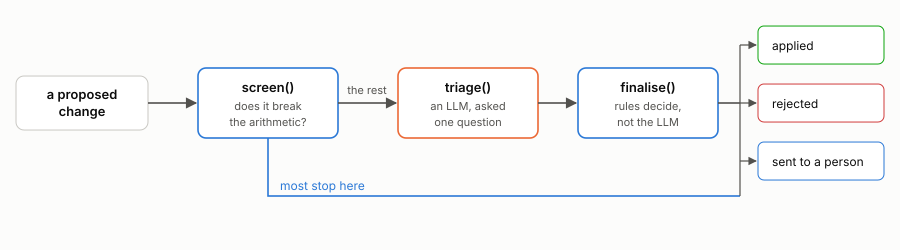
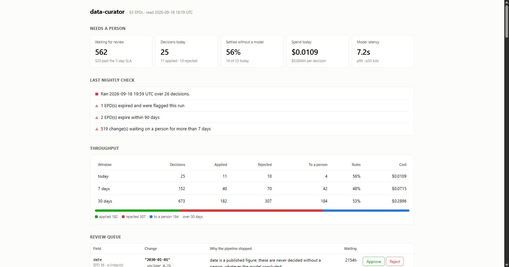

# data-curator

[](https://github.com/eirasroger/data-curator/actions/workflows/ci.yml)

Decides what to do when someone proposes changing a published environmental
product record: apply it, reject it, or send it to a person.

**[See it running →](https://eirasroger.github.io/data-curator/)**

## Why

An Environmental Product Declaration is a published document. Other people
quote its numbers in their own calculations.

So changes are risky. Apply a bad one and a wrong number spreads, and you
cannot take it back. Apply nothing and errors stay in the data.

Changes arrive from three places: a reviewer spots an error, a manufacturer
publishes a new version, or a document reaches its expiry date. All three
become the same thing, and take the same path.

## How it works



**`screen()` — arithmetic.** EPD records check themselves. Density times
thickness should equal the stated weight per unit. The parts of a carbon figure
should add up to the total. Material percentages should reach 100%.

The change is applied to a copy, and the record is checked again. If the change
breaks the arithmetic, it is rejected. No model involved. Most changes stop
here.

**`triage()` — the model.** Only for what the arithmetic cannot settle. One
question: is this a correction, or a mistake? It answers with a category, a
confidence score, and a reason.

**`finalise()` — the rules.** The model's answer is an input, not the decision:

- Changes to published figures always go to a person, at any confidence.
- Low confidence goes to a person.
- A verdict of "implausible" rejects the change.

Those rules are code in `domain/changes.py`. None of them are in the prompt.

## Try it

No Google Cloud account, no API key, nothing to pay for.

```bash
git clone https://github.com/eirasroger/data-curator.git
cd data-curator
pip install -e ".[dev]"

python scripts/seed_local.py          # load the 63 records
python -m pytest                      # the test suite
python eval/run_eval.py               # score it against labelled cases
python sim/run.py --db local.duckdb --count 500
python scripts/dashboard.py --db local.duckdb
```



It runs on a local file with a stand-in for the model. `--provider openai` uses
a real one.

## What is in here

| Folder | What it does |
| --- | --- |
| `domain/` | The rules, the model interface, the database layer |
| `services/` | Four web services: api, webhook, worker, dashboard |
| `sim/` | Makes proposals and runs them through the real pipeline |
| `eval/` | Scores the decisions against labelled cases |
| `analysis/` | Turns a run into charts and findings |
| `infra/` | Terraform for the Google Cloud setup |
| `sql/` | Table definitions, for BigQuery and for DuckDB |
| `seed/epds.json` | The 63 records |

The records come from a separate project that reads EPD PDFs. This one only
consumes them.

## Design decisions

**Two databases, one interface.** `domain/store.py` says what a datastore has
to do. BigQuery does it in the cloud, DuckDB does it on your laptop. Same
methods, same tests. That is why this runs without an account.

**Nothing is edited in place.** Applying a change writes a new version and
leaves the old one alone. When a person overrules the system, both answers stay
on the record.

**Expiry is an event.** When a document passes its date, the nightly job files
a change request like a person would, rather than quietly marking it expired.
So there is always a record of when it was noticed.

**The public endpoint has almost no power.** Manufacturers post signed updates
to their own service. It can publish to one queue and read its own signing key.
It cannot touch the database.

**The tests use the real records.** Rules that only meet made-up data tend to
work only on made-up data.

## Running it on Google Cloud

```bash
terraform -chdir=infra apply       # dataset, tables, queues, identities, secrets
gcloud secrets versions add openai-api-key --data-file=-
python scripts/seed_bigquery.py
bash scripts/deploy.sh
```

The nightly job is created paused. `bash scripts/teardown.sh` removes the
services and stops the spending; data and secrets stay.

Google Cloud has no hard spending limit, so set a budget alert first.

## Measured results

The decisions were measured rather than assumed — how often the rules settle a
change without a model, whether the confidence score can be trusted, and where
the threshold for acting alone should sit.

**[Read the findings →](analysis/FINDINGS.md)**

## Limitations

- The 63 records are real. The proposals are generated: break a value, then
  propose putting it back.
- The offline stand-in for the model knows a few arithmetic patterns and
  nothing else. Results from it describe it, not a real model.
