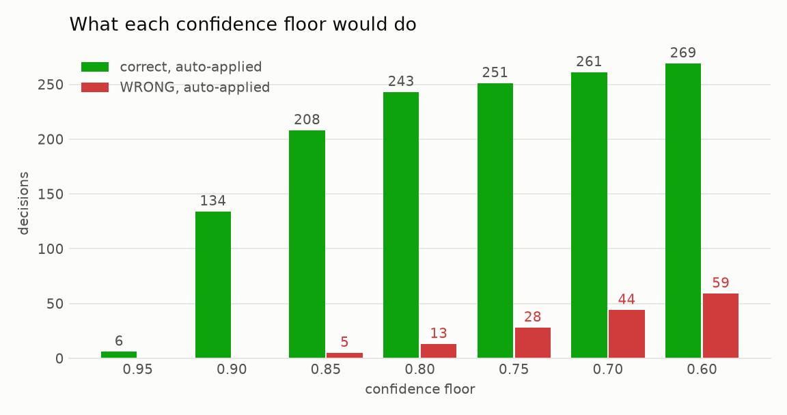

# data-curator

[](https://github.com/eirasroger/data-curator/actions/workflows/ci.yml)

data-curator manages changes to published Environmental Product Declarations
(EPDs). Each proposed change is applied, rejected, or sent to a person.
Arithmetic settles most of them, an LLM judges the rest, and fixed rules in
code limit what the LLM can decide.

**[Open the demo →](https://eirasroger.github.io/data-curator/)**

## Why

An EPD states the environmental impact of a construction product, and other
people copy its figures into their own calculations. A wrong edit spreads
quickly, so every change needs a careful decision and a record of how it was
made.

Changes come from three sources: people correcting errors, manufacturers
publishing new versions, and EPDs reaching their expiry date. All three follow
the same path.

## How it works


1. **`screen()`** applies the change to a copy of the record and checks that
   the figures still agree with each other (density × thickness = weight,
   carbon components add up to the total, and so on). Most changes are
   settled here, at no cost.
2. **`triage()`** asks the LLM whether the remaining changes are corrections or
   mistakes. It returns a category, a confidence score and a short rationale.
3. **`finalise()`** turns that answer into an outcome:
   - changes to published figures always go to a person
   - changes judged implausible are rejected
   - changes with confidence below 0.90 go to a person
   - everything else is applied

The rules live in `domain/changes.py`, where they can be read and tested.

## Features

- REST API for submitting and reviewing changes
- Signed webhook for manufacturer updates
- Nightly job that flags expired EPDs, overdue reviews and drift
- Operator dashboard for the review queue, throughput and cost
- Full version history of every record and every decision
- Runs entirely offline on a laptop, or on Google Cloud

## Built with

Python, FastAPI, Pydantic, OpenAI `gpt-5-mini`, Pub/Sub, BigQuery, DuckDB,
Jinja + HTMX, Cloud Run, Secret Manager, Cloud Scheduler, Terraform, Docker,
GitHub Actions.

## Run it locally

Needs Python 3.12+. Local mode uses DuckDB and an offline scorer in place of
the LLM, so it needs no cloud account or API key.

```bash
git clone https://github.com/eirasroger/data-curator.git
cd data-curator
pip install -e ".[dev]"

python scripts/seed_local.py                       # load the 63 records
python -m pytest                                   # run the tests
python eval/run_eval.py                            # score against 54 labelled cases
python sim/run.py --db local.duckdb --count 500    # simulate proposals
python scripts/dashboard.py --db local.duckdb      # open the dashboard
```


To use the real LLM, put an OpenAI key in `~/.config/data-curator/.env` (see
`.env.example`) and add `--provider openai` to the commands above.

## Deploy to Google Cloud

```bash
terraform -chdir=infra apply
gcloud secrets versions add openai-api-key --data-file=-
python scripts/seed_bigquery.py
bash scripts/deploy.sh
bash scripts/smoke_test.sh
```

`bash scripts/teardown.sh` removes the services and keeps the data. Set a
budget alert first, since Google Cloud has no hard spending limit.

## Repository layout

| Path | Contents |
| --- | --- |
| `domain/` | Rules, pipeline, LLM interface, database layer |
| `services/` | `api`, `webhook`, `worker`, `dashboard` |
| `sim/` | Proposal generator |
| `eval/` | Labelled cases and scoring |
| `analysis/` | Charts and numbers from a simulated run |
| `infra/` | Terraform |
| `seed/epds.json` | The 63 EPD records |

## Results

2000 simulated proposals against the 63 real records, decided by the real
pipeline with `gpt-5-mini`.

- **Half the traffic never reaches the LLM.** The rules settled 1052 proposals.
  The other 948 LLM calls cost $0.87 in total.
- **The threshold moved from 0.85 to 0.90.** At 0.85, five wrong changes were
  applied automatically. At 0.90, none were.
- **Confidence is meaningful.** When the LLM's confidence was 0.85 or higher,
  it was right 94 to 100% of the time.
- **The drift alarm works.** When the mix of incoming proposals was made
  worse, the nightly job flagged it.



Regenerate the charts with `python analysis/report.py`.
