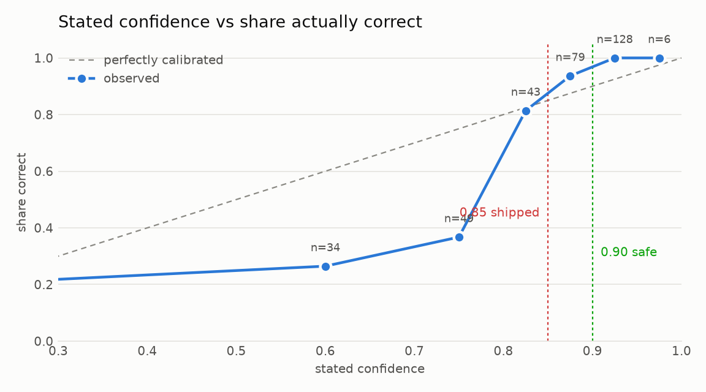
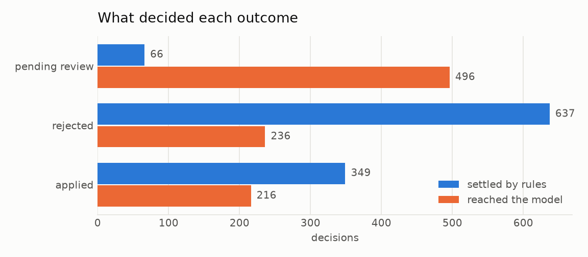
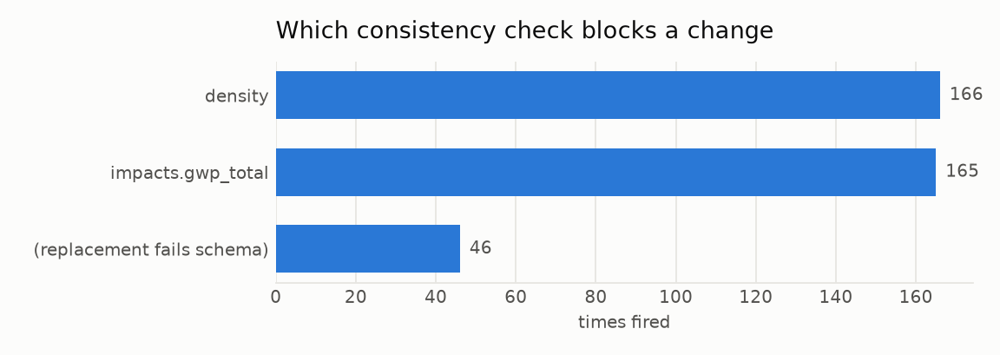
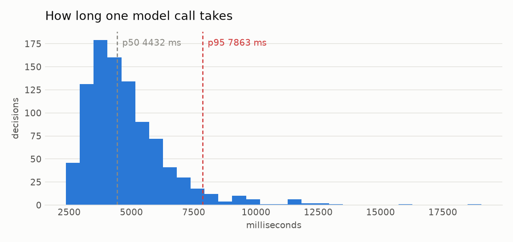
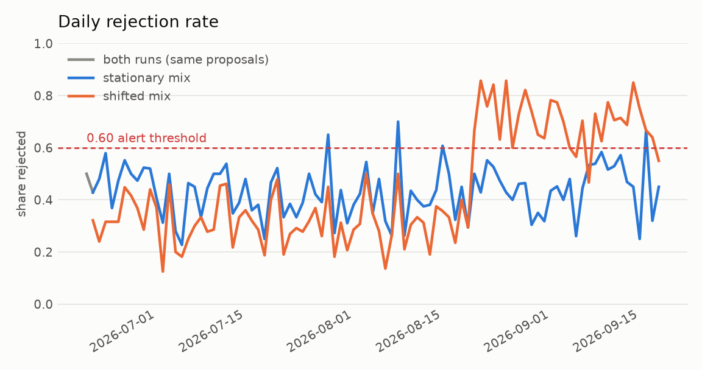

# What the decision data says

Generated by `python analysis/report.py`. 

**The data.** 2000 change proposals built from the 63 real EPD records, each
decided by the production `pipeline.decide()` with `gpt-5-mini` as the triager,
spread over a simulated 90 days. 948 of them reached the model. 

The records, the arithmetic and the decisions are real. Only the arrival of the
proposals is invented, and because each one is built to a known shape, the
correct answer for every proposal is known - which is what makes any of the
below measurable.

---

## 1. The confidence floor is set too low. It should be 0.90, not 0.85.

This is the finding that changes the code.

| floor | correct auto-applies | wrong auto-applies |
| --- | --- | --- |
| 0.95 | 6 | 0 |
| **0.90** | **134** | **0** |
| 0.85 (shipped) | 208 | **5** |
| 0.80 | 243 | 13 |
| 0.75 | 251 | 28 |
| 0.70 | 261 | 44 |
| 0.60 | 269 | 59 |

At the shipped floor of 0.85, five wrong changes are applied without a person
seeing them. At 0.90 none are. The cost of moving is 74 fewer auto-applies -
those go to review instead, which is exactly where a change nobody can verify
belongs.

The asymmetry argued in `eval/run_eval.py` settles this: a change wrongly parked
costs somebody five minutes, and a change wrongly applied corrupts a published
figure other people go on to quote. Five of the latter is not a price worth 74
of the former.

**Recommendation: raise `confidence_floor` in `changes.finalise()` to 0.90.**

## 2. A 150-case benchmark said 0.85 was safe. It was not.

`eval/triage_bench.py` scored 150 cases and reported zero unsafe applies at
0.85. This run, with 948 model calls, found five. The benchmark was not wrong
about what it saw; it was too small to see a 2% failure rate in the 0.85-0.90
band.

Worth keeping in mind before trusting any single-run eval number, this one
included.

## 3. Confidence is well calibrated, which is why any of this works.

| stated confidence | share actually correct | n |
| --- | --- | --- |
| ~0.25 | 21% | 19 |
| ~0.60 | 26% | 34 |
| ~0.75 | 37% | 49 |
| ~0.83 | 81% | 43 |
| ~0.88 | 94% | 79 |
| ~0.93 | 100% | 128 |
| ~0.98 | 100% | 6 |

Monotone throughout, with a sharp transition between 0.75 and 0.83. The model
is *under*-confident below the crossover (it says 0.6 and is right 26% of the
time - a pessimist) and accurate above it. For a gate that only ever reads the
top of the range, under-confidence at the bottom is the harmless direction to be
wrong in.

The curve crosses the diagonal at about 0.82, which is why a floor anywhere near
there behaves so differently from one at 0.90: the interesting region is only
0.08 wide.

## 4. The rules do slightly more than half the work, for nothing.

1052 of 2000 proposals (53%) were settled by deterministic rules with no model
call. The remaining 948 cost $0.87 in total.

Put another way: the arithmetic in `validation.py` and `changes.screen()` saves
about $0.96 per 2000 proposals, and more importantly returns in microseconds
what would otherwise take four seconds.

## 5. Two checks do nearly all the rejecting.

| check | times fired |
| --- | --- |
| density vs thickness x declared kg | 166 |
| GWP components vs declared total | 165 |
| replacement fails the EPD schema | 46 |

The other validation checks - end-of-life routes, C2C pairing, variant
integrity, lifespan pairing - never blocked a change in 2000 proposals. That is
partly the shape of the generated traffic, but it also says the two arithmetic
cross-checks are carrying the deterministic layer almost single-handed.

## 6. What a decision costs.

| figure | value |
| --- | --- |
| Model calls | 948 of 2000 proposals |
| Cost per call | $0.00091 |
| Cost per proposal, all in | $0.00043 |
| Latency p50 | 4432 ms |
| Latency p95 | 7863 ms |

**Caveat on the latency figures**: this run used 16 concurrent workers, so these
are queue-inflated and read high against what a single Cloud Run request would
see. They are an upper bound, not a production measurement.

Even as an upper bound they support the `--ack-deadline=60` choice in
`deploy.sh`: a p95 of 7.9s plus BigQuery writes is comfortably past the 10s
default that would cause redelivery, and nowhere near 60.

## 7. The drift detector works, and its confidence threshold no longer misfires.

Under a stationary proposal mix the daily rejection rate sits around 0.30-0.50
and never trips the 0.60 alert. When the mix shifts in the last third of the
window, the rate jumps to 0.60-0.85 and `reconcile.py` flags it.

`LOW_MEAN_CONFIDENCE = 0.60` was firing on perfectly normal traffic when the
stub was the triager - the stub's confidences top out around 0.80 on these
shapes and average 0.53, so a stationary run looked like drift. With the real
model the mean sits at **0.773** and the threshold stays quiet. No change
needed; the earlier false positive was an artifact of the stub.

**Caveat**: the shifted line in that chart is a stub-driven run, because a
matched real-model drift run has not been paid for. The rejection rate is
dominated by rule rejections, which are provider-independent, so the shape holds
- but the two lines are not strictly like for like.

## 8. The stub is not a stand-in for the model, and should not be read as one.

Same 2000 proposals, same pipeline, different triager:

| | stub | gpt-5-mini |
| --- | --- | --- |
| Applied | 349 | 565 |
| Rejected | 637 | 873 |
| Sent to review | 948 | 562 |
| Mean confidence | 0.53 | 0.77 |
| Auto-applies at any safe floor | 0 | 134 |

The stub never rejects anything on judgement and never clears the floor, so
every case it sees becomes review work. It remains useful for exactly what it
was built for - running the pipeline offline, free, deterministically - but any
number derived from a stub run describes the stub.

What the model classified, over 948 calls:

| class | n |
| --- | --- |
| implausible | 266 |
| unclear | 232 |
| decimal_slip | 180 |
| genuine_correction | 159 |
| transcription | 110 |
| unit_conversion | 1 |

`unit_conversion` fired once. Either the class is redundant with `decimal_slip`,
or the traffic here does not contain the kg/tonne confusions it was written for.
The generated `unit_confusion` proposals - a clean factor of 1000 - were
classified `implausible` instead, which is a defensible reading: the proposal
*is* wrong, and naming the mechanism is secondary.

---

## What to change

1. **Raise the confidence floor to 0.90** in `changes.finalise()`. Five wrong
   auto-applies at 0.85 is the whole argument.
2. **Leave `LOW_MEAN_CONFIDENCE` at 0.60.** It only misfired on stub histories.
3. **Consider dropping `unit_conversion`** from `TriageClass`, or rewrite its
   description so it is distinguishable from `decimal_slip` in the prompt.
4. **Do not quote the 150-case benchmark as evidence a floor is safe.** Use it
   to compare triagers; use a run of this size to set a threshold.
